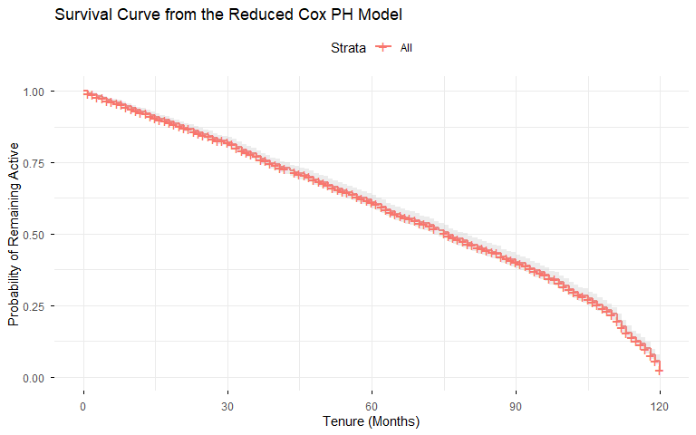
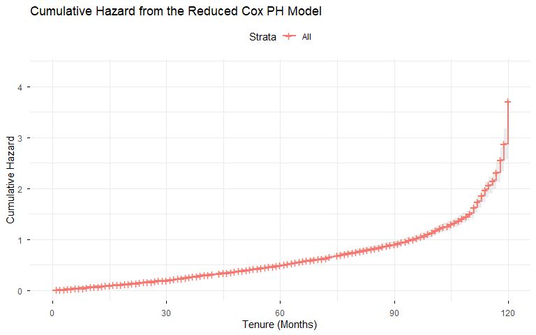
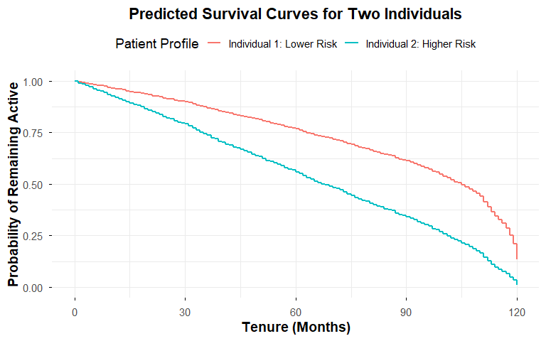
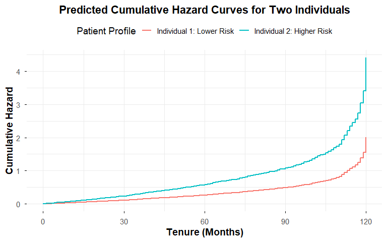

# Patient Churn Survival Analysis Using Cox Proportional Hazards

## Project Overview

Patient churn is an important challenge for healthcare organizations because losing patients can affect continuity of care, patient outcomes, operational planning, and organizational performance. This project applies **survival analysis** to examine how patient characteristics and healthcare experience factors are associated with the timing of patient churn.

The analysis uses the **Cox Proportional Hazards (Cox PH) model** in R. Rather than treating churn only as a binary outcome, survival analysis incorporates both whether churn occurred and the time until the event.

The project develops a full Cox PH model, identifies important predictors, fits a more parsimonious reduced model, evaluates the proportional hazards assumption, and demonstrates the model through patient-level survival predictions.

## Project Objectives

- Model time until patient churn using survival analysis.
- Identify factors associated with higher or lower churn hazard.
- Compare a full Cox PH model with a reduced, more interpretable model.
- Evaluate the proportional hazards assumption.
- Visualize adjusted survival and cumulative hazard.
- Demonstrate patient-level survival predictions.

## Dataset
The dataset used in this study was obtained from [Kaggle-Patient Churn Prediction Dataset for Healthcare](https://www.kaggle.com/datasets/nudratabbas/patient-churn-prediction-dataset-for-healthcare) and consists of 2,000 patient records designed to analyze healthcare engagement and churn behavior. It provides a structured representation of patient interactions with healthcare services, capturing key aspects such as demographics, satisfaction, and access-related factors.

The survival outcome is defined using:
- **Time:** `tenure_months`
- **Event:** `churned`


## Tools and Technologies

**R**, **R Markdown**, `survival`, `survminer`, `tidyverse`, `broom`, and `janitor`.

## Analytical Workflow

1. Import and prepare the patient churn data.
2. Convert variables to appropriate data types.
3. Create the survival object using tenure and churn status.
4. Fit a full Cox Proportional Hazards model.
5. Examine coefficients, hazard ratios, significance, AIC, and concordance.
6. Fit an exploratory reduced model using significant predictors from the full model.
7. Compare the full and reduced models.
8. Test the proportional hazards assumption using Schoenfeld residuals.
9. Generate adjusted survival and cumulative hazard curves.
10. Compare predicted survival for two hypothetical patient profiles.

## Cox Proportional Hazards Model

The Cox PH model is:

$$
h(t|X) = h_0(t)\exp(\beta_1X_1 + \beta_2X_2 + \cdots + \beta_pX_p)
$$

A hazard ratio above 1 indicates higher churn hazard, while a hazard ratio below 1 indicates lower churn hazard, holding other model variables constant.

## Model Results

### Full Model

| Metric | Full Model |
|---|---:|
| AIC | 18,194.01 |
| Concordance | 0.572 |

Five predictors were statistically significant at the 0.05 level and were used to construct an exploratory reduced model: **Overall Satisfaction, Days Since Last Visit, Wait-Time Satisfaction, Referrals Made, and Distance to Facility**.

### Reduced Model

| Predictor | Hazard Ratio | p-value | Interpretation |
|---|---:|---:|---|
| Overall Satisfaction | 0.9124 | 0.000707 | Higher satisfaction associated with lower churn hazard |
| Days Since Last Visit | 1.0005 | 0.000101 | Longer time since last visit associated with higher churn hazard |
| Wait-Time Satisfaction | 0.9138 | 0.000957 | Higher satisfaction associated with lower churn hazard |
| Referrals Made | 0.9503 | 0.040454 | More referrals associated with lower churn hazard |
| Distance to Facility | 1.0050 | 0.011595 | Greater distance associated with higher churn hazard |

### Interpretation

- **Overall Satisfaction:** A one-unit increase is associated with approximately an **8.8% lower churn hazard**.
- **Days Since Last Visit:** Each additional day is associated with a small increase in churn hazard; the effect accumulates over longer periods.
- **Wait-Time Satisfaction:** A one-unit increase is associated with approximately an **8.6% lower churn hazard**.
- **Referrals Made:** Each additional referral is associated with approximately a **5.0% lower churn hazard**.
- **Distance to Facility:** Each additional mile is associated with approximately a **0.5% higher churn hazard**.

These are statistical associations and should not be interpreted as causal effects.

## Model Comparison

| Model | AIC | Concordance |
|---|---:|---:|
| Full Cox PH | 18,194.01 | **0.572** |
| Reduced Cox PH | **18,170.73** | 0.552 |

The reduced model has the lower AIC, favoring a more parsimonious specification by this criterion. The full model has slightly higher concordance, indicating slightly better discrimination. The reduced model therefore improves interpretability and parsimony while giving up some discrimination.

Because the reduced model was selected using significance observed in the same dataset, its performance and predictor stability should be validated on new or resampled data before operational use.

## Proportional Hazards Assumption

The proportional hazards assumption was evaluated using **Schoenfeld residuals**. The global test produced **p = 0.92**, and the individual tests for the five reduced-model predictors also had p-values above 0.05.

Therefore, there was no statistically significant evidence that the proportional hazards assumption was violated.

## Patient Risk Profile Comparison

Two hypothetical patient profiles demonstrate how the model translates statistical relationships into patient-level predictions.

| Characteristic | Lower-Risk Profile | Higher-Risk Profile |
|---|---:|---:|
| Overall Satisfaction | 5 | 2 |
| Days Since Last Visit | 10 | 90 |
| Wait-Time Satisfaction | 5 | 2 |
| Referrals Made | 2 | 0 |
| Distance to Facility | 5 miles | 25 miles |

At **60 months**, the predicted probability of remaining active was approximately:
- **76.7%** for the lower-risk profile.
- **55.9%** for the higher-risk profile.


## Visual Results

### 1. Key Drivers of Patient Churn
 


The full-model visualization highlights the strongest predictors according to the absolute z-statistic. **Days since last visit, overall satisfaction, wait-time satisfaction, distance to the facility, and referrals made** were statistically significant at the 0.05 level. Portal usage and the Pennsylvania state indicator shown in the figure did not meet the 0.05 significance threshold.

### 2. Survival Curve from the Reduced Cox PH Model



The survival curve shows the modeled probability of remaining active as tenure increases. The probability decreases over time, illustrating the accumulation of churn risk across the observed patient-tenure period.

### 3. Cumulative Hazard from the Reduced Cox PH Model



The cumulative hazard increases as tenure progresses and becomes more pronounced toward the end of the observed period. Together, the survival and cumulative-hazard views provide complementary perspectives on the time-to-churn process.

### 4. Predicted Survival Curves for Two Patient Profiles



The patient-level survival curves demonstrate how different values of satisfaction, engagement, referrals, and distance can produce different predicted survival trajectories. At **60 months**, the predicted probability of remaining active was approximately **76.7% for the lower-risk profile** and **55.9% for the higher-risk profile**.

### 5. Predicted Cumulative Hazard for Two Patient Profiles



The higher-risk profile accumulates churn hazard more rapidly than the lower-risk profile. The difference becomes increasingly visible over time, translating the Cox model into an intuitive patient-level comparison.

---

## Key Findings

Higher **overall satisfaction**, **wait-time satisfaction**, and **referrals** were associated with lower churn hazard. A longer period since the **last visit** and greater **distance to the healthcare facility** were associated with higher churn hazard.

The reduced model provides a concise and interpretable view of churn-related patterns. However, the modest concordance indicates that substantial unexplained variation remains; this should be viewed as an interpretable statistical analysis rather than a high-accuracy production churn system.

## Potential Applications

Subject to validation, governance, and privacy safeguards, this type of analysis could support patient-retention analysis, patient-engagement initiatives, investigation of satisfaction and wait-time experiences, analysis of access barriers, and retention-focused dashboards.

The model should support—not replace—clinical or operational judgment.

## Limitations

- The analysis identifies associations, not causality.
- The reduced model was derived using statistical significance in the same dataset.
- Model discrimination is modest.
- Results depend on the quality and representativeness of the dataset.
- External or resampling-based validation is needed before operational use.
- Important churn predictors may not be represented in the available variables.

## Repository Structure

```text
patient-churn-coxph-survival-analysis/
├── Patient_Churn_Cox_Model_No_Pipes_Easy_Read.Rmd
├── data/
│   └── patient_churn_dataset.csv
├── docs/
│   └── PatientChurnCoxModel.pdf
├── figures/
├── results/
└── README.md
```


### Selected Figure Files

```text
figures/
├── Key_Drivers_of_Patient_Churn_Full_Model.png
├── Survival_Curve_from_the_Reduced_Cox_PH_Model.png
├── Cumulative_Hazard_from_the_Reduced_Cox_PH_Model.png
├── Predicted_Survival_Curves_for_Two_Individuals.png
└── Predicted_Cumulative_Hazard_Curves_for_Two_Individuals.png
```

## Reproducing the Analysis

1. Clone or download the repository.
2. Open the project in RStudio.
3. Install the required R packages if necessary.
4. Place the permitted dataset at `data/patient_churn_dataset.csv`.
5. Open `Patient_Churn_Cox_Model_No_Pipes_Easy_Read.Rmd`.
6. Knit the R Markdown document.


## Future Improvements

Future work could include bootstrap or cross-validation, independent validation, penalized Cox regression, nonlinear effects and interactions, time-dependent covariates, additional survival metrics, and comparison with Random Survival Forests or other machine-learning survival methods.

## Author

**Baba Sirima**

Data Science | Machine Learning | Statistical Modeling | Data Visualization

## Disclaimer

This project is intended for educational and portfolio purposes. The results should not be interpreted as medical advice or used for clinical decision-making without appropriate validation, governance, domain expertise, and privacy safeguards.

## Skills Demonstrated

This project demonstrates practical skills across the complete data science and statistical modeling workflow:

- **Data Preparation & Cleaning:** Imported, cleaned, transformed, and validated structured healthcare data in R for survival analysis.

- **Exploratory Data Analysis:** Examined patient characteristics, churn outcomes, and predictor distributions to understand patterns in the dataset.

- **Survival Analysis:** Applied time-to-event analysis to model patient churn using patient tenure as the time variable and churn status as the event.

- **Cox Proportional Hazards Modeling:** Developed full and reduced Cox PH regression models to evaluate factors associated with patient churn over time.

- **Statistical Modeling & Inference:** Evaluated regression coefficients, hazard ratios, confidence intervals, p-values, and statistical significance.

- **Model Selection & Comparison:** Compared full and reduced Cox models using Akaike Information Criterion (AIC), concordance, model complexity, and interpretability.

- **Model Diagnostics:** Evaluated the proportional hazards assumption using Schoenfeld residual tests and global model diagnostics.

- **Risk Factor Analysis:** Identified key churn-related factors, including overall satisfaction, wait-time satisfaction, days since last visit, referrals, and distance to the healthcare facility.

- **Patient-Level Predictive Analysis:** Generated survival and cumulative hazard predictions for hypothetical patient profiles to demonstrate differences in churn risk over time.

- **Data Visualization:** Developed clear visualizations of model predictors, survival probabilities, cumulative hazard, and patient-level risk trajectories using R.

- **Reproducible Analytics:** Built the complete analysis in R Markdown, integrating data preparation, statistical modeling, visualization, interpretation, and reporting into a reproducible workflow.

- **Technical Communication:** Translated statistical model results and hazard ratios into understandable healthcare and business insights for technical and non-technical audiences.

### Technical Skills

`R` • `R Markdown` • `Survival Analysis` • `Cox Proportional Hazards` • `Statistical Modeling` • `Hypothesis Testing` • `Model Diagnostics` • `AIC` • `Concordance` • `Schoenfeld Residuals` • `Data Cleaning` • `Data Visualization` • `tidyverse` • `survival` • `survminer` • `broom` • `janitor`
